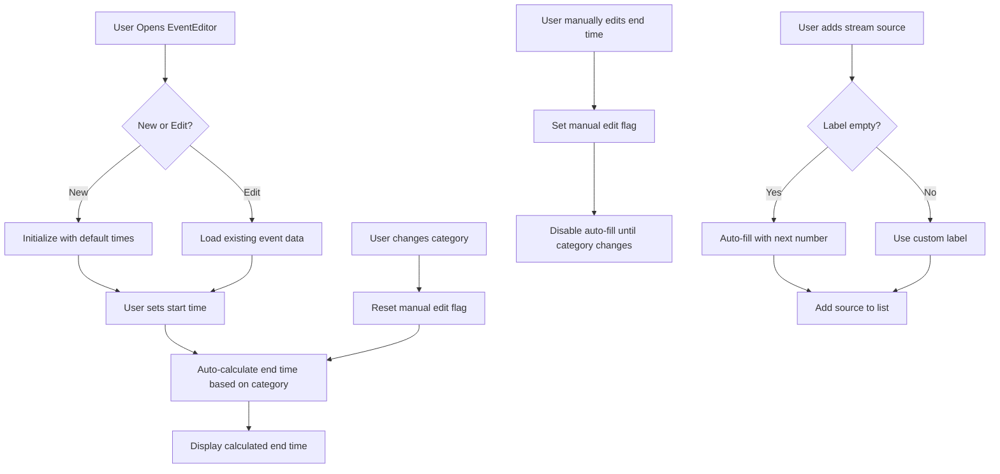

# Event Editor Auto-Fill Implementation Plan

## Overview
Implement automatic end time calculation based on sport category and sequential auto-numbering for stream source labels in the EventEditor component.

## Requirements

### 1. Auto-Fill End Time Based on Category
When the start time or category changes, automatically calculate and set the end time:
- **Default (all other sports)**: 2 hours ahead
- **Football**: 1 hour 45 minutes ahead (105 minutes)
- **NBA**: 3 hours ahead (180 minutes)
- **NFL**: 3 hours 30 minutes ahead (210 minutes)

### 2. Auto-Number Source Labels
When adding new stream sources, automatically populate the label field with sequential numbers (1, 2, 3, etc.)

---

## Implementation Details

### Part 1: Auto-Fill End Time

#### Step 1: Create Duration Helper Function
**Location**: [`pages/Admin/EventEditor.tsx`](pages/Admin/EventEditor.tsx:28)

Add a helper function to calculate duration in milliseconds based on category:

```typescript
const getEventDurationMs = (category: EventCategory): number => {
  switch (category) {
    case EventCategory.FOOTBALL:
      return 105 * 60 * 1000; // 1 hour 45 minutes
    case EventCategory.NBA:
      return 180 * 60 * 1000; // 3 hours
    case EventCategory.NFL:
      return 210 * 60 * 1000; // 3 hours 30 minutes
    default:
      return 120 * 60 * 1000; // 2 hours (default)
  }
};
```

**Duration Breakdown**:
- Football: 105 minutes = 6,300,000 ms
- NBA: 180 minutes = 10,800,000 ms
- NFL: 210 minutes = 12,600,000 ms
- Default: 120 minutes = 7,200,000 ms

#### Step 2: Add State for Manual Override Tracking
**Location**: After line 83 in [`EventEditor.tsx`](pages/Admin/EventEditor.tsx:83)

Add a state variable to track if the user has manually edited the end time:

```typescript
const [endTimeManuallyEdited, setEndTimeManuallyEdited] = useState(false);
```

This prevents auto-fill from overriding user's manual changes.

#### Step 3: Implement Auto-Fill Logic with useEffect
**Location**: After line 164 in [`EventEditor.tsx`](pages/Admin/EventEditor.tsx:164)

Add a useEffect hook that watches for changes to `startTime` or `category`:

```typescript
// Auto-update endTime when startTime or category changes (unless manually edited)
useEffect(() => {
  // Only auto-fill if:
  // 1. We have a start time
  // 2. End time hasn't been manually edited
  // 3. Initial load is complete (to avoid overriding existing event data)
  if (formData.startTime && !endTimeManuallyEdited && initialLoadComplete.current) {
    const startDate = new Date(formData.startTime);
    const durationMs = getEventDurationMs(formData.category || EventCategory.FOOTBALL);
    const endDate = new Date(startDate.getTime() + durationMs);
    
    setFormData(prev => ({
      ...prev,
      endTime: endDate.toISOString().slice(0, 16)
    }));
  }
}, [formData.startTime, formData.category, endTimeManuallyEdited]);
```

#### Step 4: Update End Time Input Handler
**Location**: Line 510 in [`EventEditor.tsx`](pages/Admin/EventEditor.tsx:510)

Modify the end time input to set the manual edit flag:

```typescript
<input 
  type="datetime-local" 
  value={formData.endTime} 
  onChange={e => {
    setEndTimeManuallyEdited(true); // Mark as manually edited
    setFormData({ ...formData, endTime: e.target.value });
  }} 
  className="w-full bg-[#0B0C10] border border-white/10 rounded-xl px-4 py-3 text-xs outline-none" 
/>
```

#### Step 5: Reset Manual Edit Flag on Category Change
**Location**: Within the category change handler at line 380

When category changes, reset the manual edit flag to allow auto-fill:

```typescript
<select 
  value={formData.category} 
  onChange={e => {
    setEndTimeManuallyEdited(false); // Reset flag to allow auto-fill
    setFormData({ ...formData, category: e.target.value as EventCategory });
  }} 
  className="w-full bg-[#0B0C10] border border-white/10 rounded-xl px-4 py-3 text-sm font-bold focus:ring-1 focus:ring-[#04C4FC] outline-none text-white transition-all appearance-none"
>
```

#### Step 6: Update Initial State
**Location**: Line 46 in [`EventEditor.tsx`](pages/Admin/EventEditor.tsx:46)

Update the initial endTime calculation to use the helper function:

```typescript
endTime: new Date(Date.now() + getEventDurationMs(EventCategory.FOOTBALL)).toISOString().slice(0, 16),
```

---

### Part 2: Auto-Number Source Labels

#### Step 1: Create Next Label Number Helper
**Location**: After the `getEventDurationMs` function

Add a helper function to calculate the next sequential number:

```typescript
const getNextSourceLabel = (servers: StreamServer[]): string => {
  if (!servers || servers.length === 0) return '1';
  return String(servers.length + 1);
};
```

#### Step 2: Update addServer Function
**Location**: Line 262 in [`EventEditor.tsx`](pages/Admin/EventEditor.tsx:262)

Modify the `addServer` function to auto-populate the label if empty:

```typescript
const addServer = () => {
  // Auto-fill name with next number if empty
  const serverName = newServer.name?.trim() || getNextSourceLabel(formData.servers || []);
  
  if (!newServer.embedUrl) return;
  
  const serverId = crypto.randomUUID();
  const server: StreamServer = {
    id: serverId,
    name: serverName, // Use auto-generated or user-provided name
    embedUrl: newServer.embedUrl,
    streamType: newServer.streamType as 'embed' | 'hls',
    isActive: newServer.isActive!,
    isDefault: newServer.isDefault!,
    sortOrder: 0
  };
  
  // ... rest of the function remains the same
};
```

#### Step 3: Add Placeholder to Source Label Input
**Location**: Line 710 in [`EventEditor.tsx`](pages/Admin/EventEditor.tsx:710)

Update the input field to show the next number as a placeholder:

```typescript
<input 
  placeholder={`Source ${getNextSourceLabel(formData.servers || [])}`}
  value={newServer.name} 
  onChange={e => setNewServer({ ...newServer, name: e.target.value })} 
  className="w-full bg-[#0B0C10] border border-white/10 rounded-xl px-4 py-2 text-xs" 
/>
```

This provides visual feedback showing what number will be used if left empty.

---

## Edge Cases & Considerations

### End Time Auto-Fill
1. **Editing Existing Events**: The `initialLoadComplete` ref ensures auto-fill doesn't override existing event data on load
2. **Manual Override**: Once user manually edits end time, auto-fill stops until category changes
3. **Category Switch**: Changing category resets the manual edit flag, allowing new duration to apply
4. **Invalid Start Time**: Auto-fill only runs when `startTime` is valid

### Source Label Auto-Numbering
1. **Empty Label**: If user leaves label empty, next sequential number is used
2. **Custom Label**: If user types a custom label, it's preserved
3. **Deleted Sources**: Numbers don't renumber existing sources when one is deleted
4. **Editing Sources**: Existing source labels remain unchanged

---

## Testing Checklist

### End Time Auto-Fill Tests
- [ ] Create new event with default category → end time should be 2 hours ahead
- [ ] Create new event with Football category → end time should be 1h 45m ahead
- [ ] Create new event with NBA category → end time should be 3 hours ahead
- [ ] Create new event with NFL category → end time should be 3h 30m ahead
- [ ] Change start time → end time should update automatically
- [ ] Change category → end time should recalculate with new duration
- [ ] Manually edit end time → should stop auto-updating
- [ ] After manual edit, change category → should resume auto-updating
- [ ] Edit existing event → should not override existing end time on load

### Source Label Auto-Numbering Tests
- [ ] Add first source with empty label → should auto-fill "1"
- [ ] Add second source with empty label → should auto-fill "2"
- [ ] Add third source with empty label → should auto-fill "3"
- [ ] Add source with custom label → should preserve custom label
- [ ] Delete middle source → remaining sources keep their numbers
- [ ] Placeholder shows correct next number before adding

---

## Files to Modify

1. **[`pages/Admin/EventEditor.tsx`](pages/Admin/EventEditor.tsx:1)** - Main implementation file
   - Add `getEventDurationMs` helper function
   - Add `getNextSourceLabel` helper function
   - Add `endTimeManuallyEdited` state
   - Add useEffect for auto-fill end time
   - Update end time input handler
   - Update category select handler
   - Update `addServer` function
   - Update source label input placeholder

---

## Implementation Flow Diagram



---

## Summary

This implementation provides intelligent auto-fill behavior that:
- Respects sport-specific event durations
- Allows manual overrides when needed
- Simplifies source management with auto-numbering
- Maintains data integrity for existing events
- Provides clear visual feedback to users

The changes are minimal, focused, and maintain backward compatibility with existing functionality.
