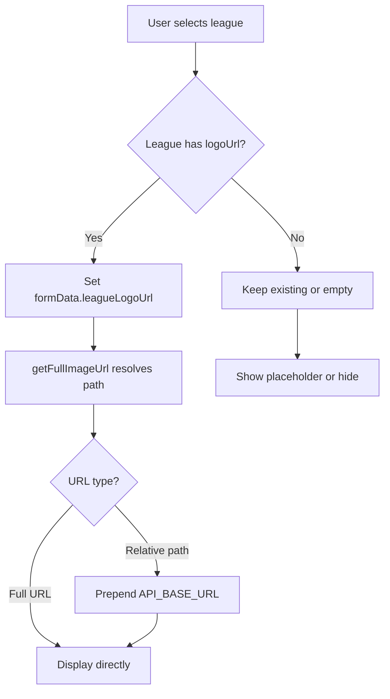
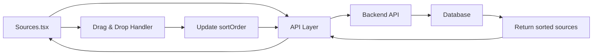
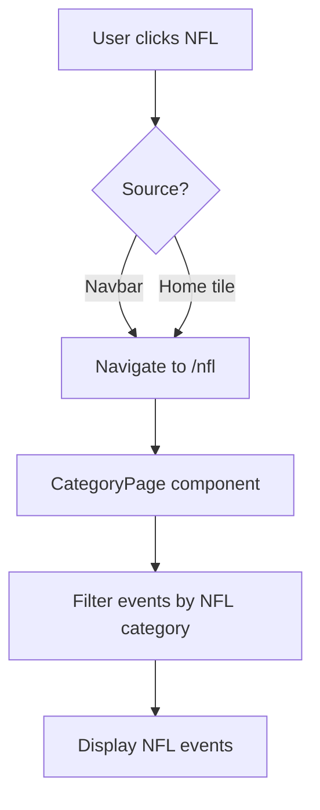

# Implementation Plan: 6 Bug Fixes & Features

## Overview
This document outlines the implementation strategy for 6 tasks across the IPTV admin panel and public-facing application.

---

## Task 1: Fix League Logo Preview in EventEditor

### Problem
When a league is selected in [`EventEditor.tsx`](../pages/Admin/EventEditor.tsx), the league logo preview doesn't display correctly, even though the league has a `logoUrl` set.

### Root Cause Analysis
Looking at lines 393-456 in [`EventEditor.tsx`](../pages/Admin/EventEditor.tsx:393):
- League selection updates `formData.league` (name) and `formData.leagueId`
- League logo is auto-filled: `leagueLogoUrl: league.logoUrl || formData.leagueLogoUrl`
- However, the preview at line 547 uses `getFullImageUrl()` which may not handle the logo URL correctly

### Solution
1. **Fix the league logo binding** in the league selection handler (lines 423-432)
2. **Ensure proper URL resolution** using [`getFullImageUrl()`](../api.ts:308) from api.ts
3. **Handle both create and edit flows**:
   - Create: Auto-fill logo when league selected
   - Edit: Display existing logo on load
4. **Add fallback handling** for missing logos

### Files to Modify
- [`pages/Admin/EventEditor.tsx`](../pages/Admin/EventEditor.tsx:547) - Fix logo preview rendering
- Ensure `league.logoUrl` is properly passed and displayed

### Implementation Steps
1. Update league selection handler to properly set `leagueLogoUrl`
2. Verify `getFullImageUrl()` handles relative paths correctly
3. Test with leagues that have:
   - Full URL logos
   - Relative path logos
   - Missing logos (null/undefined)

---

## Task 2: Create Sources Admin Page with Edit & Drag Ordering

### Problem
No dedicated Sources management page exists. Need to create `/admin/sources` with:
- List of all stream sources
- Edit button per source
- Drag-and-drop reordering
- Persistent order storage

### Current State
- Sources are currently managed per-event in [`EventEditor.tsx`](../pages/Admin/EventEditor.tsx:572)
- No global sources management
- No API endpoints for sources CRUD operations

### Solution Architecture

#### Backend Requirements (API)
```typescript
// New endpoints needed:
GET    /api/sources           // List all sources
GET    /api/sources/:id       // Get single source
POST   /api/sources           // Create source
PUT    /api/sources/:id       // Update source
DELETE /api/sources/:id       // Delete source
PUT    /api/sources/reorder   // Bulk reorder
```

#### Frontend Implementation
Create new file: [`pages/Admin/Sources.tsx`](../pages/Admin/Sources.tsx)

**Features:**
1. **List View**
   - Display all sources in a table/grid
   - Show: name, embedUrl, streamType, isActive, isDefault, sortOrder
   - Drag handles for reordering

2. **Edit Modal/Form**
   - Inline editing or modal popup
   - Fields: name, embedUrl, streamType, isActive, isDefault
   - Save changes via API

3. **Drag & Drop**
   - Use HTML5 drag-and-drop API or library (react-beautiful-dnd alternative)
   - Update sortOrder on drop
   - Persist to backend immediately or on "Save Order" button

4. **Order Persistence**
   - Store `sortOrder` field in database
   - Backend returns sources sorted by `sortOrder` by default
   - Normalize order values (1, 2, 3...) to avoid gaps

### Files to Create/Modify
- **Create:** [`pages/Admin/Sources.tsx`](../pages/Admin/Sources.tsx) - New admin page
- **Modify:** [`App.tsx`](../App.tsx:148) - Add route for `/admin/sources`
- **Modify:** [`admin/layout/AdminLayout.tsx`](../admin/layout/AdminLayout.tsx:33) - Add Sources nav item
- **Modify:** [`api.ts`](../api.ts) - Add sources API functions
- **Modify:** [`types.ts`](../types.ts:20) - Ensure StreamServer has sortOrder field (already exists)

### Implementation Steps
1. Add API functions to [`api.ts`](../api.ts)
2. Create [`Sources.tsx`](../pages/Admin/Sources.tsx) component (similar structure to [`Leagues.tsx`](../pages/Admin/Leagues.tsx))
3. Implement drag-and-drop functionality
4. Add route to [`App.tsx`](../App.tsx)
5. Add navigation link to [`AdminLayout.tsx`](../admin/layout/AdminLayout.tsx)
6. Test reordering and persistence

---

## Task 3: Remove Ads from ALL Admin Panel Pages

### Problem
Admin panel should be ad-free, but ads may be loading on admin routes.

### Current Ad Implementation
- [`App.tsx`](../App.tsx:38) has `AdManager` component
- [`AdManager`](../App.tsx:38) checks `isAdminPage` at line 40: `const isAdminPage = location.pathname.startsWith('/admin');`
- Already has conditional logic to skip ads on admin pages

### Verification Needed
1. Check if `AdManager` properly skips admin routes (line 75-94)
2. Verify no [`AdSlot`](../components/AdSlot.tsx) components in admin pages
3. Ensure no aclib scripts load on admin routes

### Solution
The code already has protection:
```typescript
if (isAdminPage) return; // Lines 75, 98, 120
```

**Additional safeguards:**
1. Add explicit check in [`AdSlot.tsx`](../components/AdSlot.tsx) component
2. Verify no admin pages import/use AdSlot
3. Add comment documentation

### Files to Verify/Modify
- [`App.tsx`](../App.tsx:40) - Verify isAdminPage logic
- [`components/AdSlot.tsx`](../components/AdSlot.tsx) - Add admin route check
- All admin pages - Verify no AdSlot usage

### Implementation Steps
1. Audit all admin pages for AdSlot usage
2. Add defensive check in AdSlot component
3. Test by visiting all admin routes and checking DevTools Network tab
4. Verify no aclib requests on admin pages

---

## Task 4: Autopurge Default to True

### Problem
The "Autopurge" checkbox should default to checked (true) for new events.

### Current Implementation
In [`EventEditor.tsx`](../pages/Admin/EventEditor.tsx:78):
```typescript
const [autoPurge, setAutoPurge] = useState(false); // Line 78
```

### Solution
Change default state to `true`:
```typescript
const [autoPurge, setAutoPurge] = useState(true);
```

### Additional Considerations
1. **New events only** - Don't change existing events
2. **Backend default** - Ensure backend also defaults to true if field missing
3. **Edit mode** - Preserve existing value when editing

### Files to Modify
- [`pages/Admin/EventEditor.tsx`](../pages/Admin/EventEditor.tsx:78) - Change useState default

### Implementation Steps
1. Change `useState(false)` to `useState(true)` at line 78
2. Verify behavior:
   - New event: checkbox checked by default
   - Edit event: preserves saved value
   - Saving without touching checkbox: persists autopurge=true
3. Test create and edit flows

---

## Task 5: Create NFL Page & Add to Navigation

### Problem
Need a dedicated NFL page accessible from home screen and navbar.

### Current State
- NFL is part of EventCategory enum in [`types.ts`](../types.ts:4)
- NFL events grouped under "Other Sports" in [`Home.tsx`](../pages/Public/Home.tsx:66)
- No dedicated NFL route or navigation item

### Solution

#### 1. Create NFL Route
NFL should use existing [`CategoryPage.tsx`](../pages/Public/CategoryPage.tsx) component with slug `/nfl`

#### 2. Update Navigation
**Navbar** ([`components/Navbar.tsx`](../components/Navbar.tsx)):
- Add NFL link at line 78 (desktop nav)
- Add NFL link at line 103 (mobile nav)

**Home Screen** ([`pages/Public/Home.tsx`](../pages/Public/Home.tsx)):
- Currently NFL is grouped in "Other Sports" (line 66)
- Need to add NFL as separate category in `CATEGORY_ORDER`

#### 3. Update Category Handling
**Constants** ([`constants.ts`](../constants.ts:13)):
```typescript
export const CATEGORY_ORDER = [
  'Special',
  EventCategory.FOOTBALL,
  EventCategory.NBA,
  EventCategory.NFL,  // Add this
  EventCategory.OTHER
];
```

**Types** ([`types.ts`](../types.ts:90)):
Update `categoryFromSlug` function to handle 'nfl' slug

### Files to Modify
- [`constants.ts`](../constants.ts:13) - Add NFL to CATEGORY_ORDER
- [`types.ts`](../types.ts:96) - Add NFL slug mapping
- [`components/Navbar.tsx`](../components/Navbar.tsx:78) - Add NFL nav links
- [`pages/Public/Home.tsx`](../pages/Public/Home.tsx:66) - Update category grouping
- [`pages/Public/CategoryPage.tsx`](../pages/Public/CategoryPage.tsx:36) - Verify NFL handling

### Implementation Steps
1. Add NFL to `CATEGORY_ORDER` in constants
2. Add NFL slug mapping in types.ts
3. Add NFL links to Navbar (desktop + mobile)
4. Update Home.tsx to show NFL as separate category
5. Test navigation from home and navbar
6. Verify NFL events display correctly on /nfl route

---

## Task 6: Replace "Precise Hero Leaderboard" Ad Slots

### Problem
Need to replace all "precise hero leaderboard" ad placements with new script using zoneId `10766646`.

### Current Ad Implementation
**Ad Slot System:**
- [`constants.ts`](../constants.ts:37) defines `AD_SLOT_ZONE_MAP`
- [`components/AdSlot.tsx`](../components/AdSlot.tsx) renders ad slots
- [`App.tsx`](../App.tsx:38) manages ad loading via `AdManager`

### Identifying "Precise Hero Leaderboard" Slots
Search for slots with "hero" or "leaderboard" in name:
- `home_hero_leaderboard` (line 39 in constants.ts)
- `watch_top_leaderboard` (line 41 in constants.ts)

### Current Usage
**Home Page** ([`pages/Public/Home.tsx`](../pages/Public/Home.tsx:186)):
```tsx
<AdSlot slotKey="home_hero_leaderboard" label="Hero Leaderboard" className="min-h-[120px]" />
```

**Watch Page** ([`pages/Public/Watch.tsx`](../pages/Public/Watch.tsx)):
Need to check for leaderboard slots

### Solution

#### Option A: Update Zone Mapping (Recommended)
Update [`constants.ts`](../constants.ts:39):
```typescript
export const AD_SLOT_ZONE_MAP = {
  // ... other slots
  home_hero_leaderboard: '10766646',  // Change from PRIMARY_AD_ZONE
  watch_top_leaderboard: '10766646',  // Change from PRIMARY_AD_ZONE
  // ... other slots
} as const;
```

#### Option B: Custom Script Injection
If the new script format is different from `runAutoTag`, create custom component:
```tsx
<div>
  <script type="text/javascript">
    aclib.runBanner({
      zoneId: '10766646',
    });
  </script>
</div>
```

### Files to Modify
- [`constants.ts`](../constants.ts:39) - Update zone IDs for hero leaderboard slots
- Verify no other "precise hero leaderboard" references exist

### Implementation Steps
1. Search codebase for "hero" and "leaderboard" references
2. Identify all affected ad slots
3. Update zone IDs in constants.ts
4. Test on public pages (not admin)
5. Verify new zoneId loads correctly
6. Check for duplicate banner issues
7. Confirm admin pages remain ad-free

---

## Testing Strategy

### Task 1: League Logo Preview
- [ ] Select league with full URL logo → logo displays
- [ ] Select league with relative path logo → logo displays
- [ ] Select league with no logo → no broken image
- [ ] Edit existing event with league → logo displays on load
- [ ] Create new event, select league → logo displays immediately

### Task 2: Sources Management
- [ ] Navigate to /admin/sources → page loads
- [ ] View list of sources → all sources displayed
- [ ] Click Edit → modal/form opens with source data
- [ ] Edit source → changes save successfully
- [ ] Drag source to new position → order updates visually
- [ ] Refresh page → order persists
- [ ] Reorder 10+ sources → only minimal API calls

### Task 3: Ad Removal
- [ ] Visit /admin → no ads visible
- [ ] Visit /admin/teams → no ads visible
- [ ] Visit /admin/leagues → no ads visible
- [ ] Visit /admin/settings → no ads visible
- [ ] Visit /admin/events/new → no ads visible
- [ ] Check DevTools Network → no aclib requests on admin routes
- [ ] Visit public pages → ads still load correctly

### Task 4: Autopurge Default
- [ ] Create new event → Autopurge checked by default
- [ ] Save without touching checkbox → autopurge=true in DB
- [ ] Edit existing event with autopurge=false → remains false
- [ ] Edit existing event with autopurge=true → remains true

### Task 5: NFL Page
- [ ] Click NFL in navbar → navigates to /nfl
- [ ] Click NFL on home screen → navigates to /nfl
- [ ] /nfl page loads → displays NFL events only
- [ ] Direct load /nfl → page works (no 404)
- [ ] Mobile navbar → NFL link present and works
- [ ] Home page → NFL shows as separate category

### Task 6: Hero Leaderboard Ads
- [ ] Home page → hero leaderboard uses zoneId 10766646
- [ ] Watch page → top leaderboard uses zoneId 10766646
- [ ] No duplicate banners appear
- [ ] Banner loads within 200ms
- [ ] Admin pages → no banner injection
- [ ] Production build → works correctly

---

## Implementation Order

### Phase 1: Quick Wins (Low Risk)
1. **Task 4** - Autopurge default (1 line change)
2. **Task 3** - Verify ad removal (already implemented, just verify)
3. **Task 6** - Update ad zone IDs (constants change)

### Phase 2: Medium Complexity
4. **Task 1** - Fix league logo preview (EventEditor logic)
5. **Task 5** - Add NFL page (routing + navigation)

### Phase 3: Complex Feature
6. **Task 2** - Create Sources admin page (new page + API + drag-drop)

---

## Risk Assessment

### Low Risk
- Task 3 (Ad removal) - Already implemented
- Task 4 (Autopurge default) - Simple state change
- Task 6 (Ad zone update) - Configuration change

### Medium Risk
- Task 1 (League logo) - UI binding issue
- Task 5 (NFL page) - Routing and navigation

### High Risk
- Task 2 (Sources page) - New feature, requires backend API

---

## Backend API Requirements

### Task 2: Sources Management
The backend needs these endpoints:

```typescript
// GET /api/sources
// Returns: { success: boolean, data: StreamServer[] }

// GET /api/sources/:id
// Returns: { success: boolean, data: StreamServer }

// POST /api/sources
// Body: StreamServer (without id)
// Returns: { success: boolean, data: StreamServer }

// PUT /api/sources/:id
// Body: Partial<StreamServer>
// Returns: { success: boolean, data: StreamServer }

// DELETE /api/sources/:id
// Returns: { success: boolean }

// PUT /api/sources/reorder
// Body: { sources: Array<{ id: string, sortOrder: number }> }
// Returns: { success: boolean }
```

**Database Schema:**
```sql
-- Ensure sortOrder field exists
ALTER TABLE sources ADD COLUMN sortOrder INTEGER DEFAULT 0;

-- Create index for efficient ordering
CREATE INDEX idx_sources_sortOrder ON sources(sortOrder);
```

---

## Mermaid Diagrams

### Task 1: League Logo Preview Flow


### Task 2: Sources Page Architecture


### Task 5: NFL Navigation Flow


---

## Success Criteria

### Task 1: League Logo Preview
✅ Logo displays immediately when league selected  
✅ Edit page shows correct logo on load  
✅ No broken images for missing logos  
✅ Works with full URLs and relative paths  

### Task 2: Sources Management
✅ /admin/sources page accessible  
✅ Edit button per source works  
✅ Drag-and-drop reordering functional  
✅ Order persists after refresh  
✅ Minimal API calls during reorder  

### Task 3: Ad Removal
✅ No ads visible on any admin page  
✅ No aclib scripts load on admin routes  
✅ Public pages still show ads correctly  

### Task 4: Autopurge Default
✅ New events have Autopurge checked by default  
✅ Saving without interaction persists autopurge=true  
✅ Editing preserves existing autopurge value  

### Task 5: NFL Page
✅ /nfl route works and displays NFL events  
✅ NFL link in navbar (desktop + mobile)  
✅ NFL tile on home screen  
✅ Direct navigation to /nfl works  

### Task 6: Hero Leaderboard Ads
✅ Hero leaderboard slots use zoneId 10766646  
✅ No duplicate banners  
✅ Loads within 200ms  
✅ Admin pages remain ad-free  
✅ Works in production build  

---

## Notes

- All changes should maintain existing functionality
- Follow existing code patterns and styling
- Test on both desktop and mobile viewports
- Verify production build after changes
- Update documentation if needed