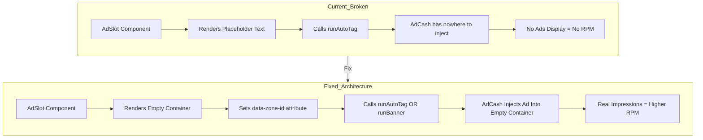

# RPM Drop Analysis: React SPA vs Static HTML Site

## Executive Summary

Your RPM dropped from **$3-5 to $0.50-1** after migrating from static HTML/CSS to React SPA. After thorough code analysis, I've identified **7 critical issues** causing this dramatic drop. The root cause is that **your ad slots are not actually rendering ads** - they're just displaying placeholder text.

---

## Critical Issue #1: AdSlot Component Only Renders Placeholder Text

**Location:** [`components/AdSlot.tsx`](components/AdSlot.tsx:95-99)

```tsx
return (
  <div ref={containerRef} className={combinedClassName}>
    <span className="pointer-events-none select-none">Ad Slot · {displayLabel}</span>
  </div>
);
```

### Problem
The AdSlot component renders a **styled placeholder** with text like "Ad Slot · Footer Banner" instead of an empty container for AdCash to inject ads into. AdCash's `runAutoTag` expects an empty `<div data-zone-id="..."></div>` to inject its iframe/ad content. Your placeholder text is **blocking ad injection**.

### Impact
- **Every AdSlot on your site shows placeholder text instead of actual ads**
- This affects: navbar_banner, home_hero_leaderboard, home_mid_feed, watch_top_leaderboard, watch_sidebar_sticky, watch_below_sources, category_top_banner, footer_banner
- Result: **Near-zero impressions** from AdSlot components

---

## Critical Issue #2: Conflicting Ad Initialization Methods

Your codebase has **4 competing ad initialization systems** that cause race conditions:

| Location | Method | When |
|----------|--------|------|
| [`index.html`](index.html:119-180) | `runAutoTag` | Page load |
| [`App.tsx`](App.tsx:68-72) AdManager | `runAutoTag` | Route change + 45s interval |
| [`AdSlot.tsx`](components/AdSlot.tsx:79-91) | `runAutoTag` | Mount + custom interval |
| [`Home.tsx`](pages/Public/Home.tsx:35-49) | `runBanner` | useEffect |

### Problem
- Multiple scripts call the same zone simultaneously
- Race conditions cause ads to fail silently
- Home.tsx correctly uses `runBanner` with a proper container ID, but AdSlot uses `runAutoTag` without proper structure

---

## Critical Issue #3: Zone ID Confusion

**Location:** [`constants.ts`](constants.ts:29-47)

```typescript
export const PRIMARY_AD_ZONE = 'ezlzq7hamb';
export const AD_SLOT_ZONE_MAP = {
  navbar_banner: PRIMARY_AD_ZONE,
  home_hero_leaderboard: '10766646', // Different zone!
  home_mid_feed: PRIMARY_AD_ZONE,
  watch_top_leaderboard: '10766646', // Different zone!
  // ...
};
```

### Problem
- Mixed zone ID formats: `'ezlzq7hamb'` vs `'10766646'`
- The `10766646` zones likely require `runBanner` method, not `runAutoTag`
- AdSlot uses `runAutoTag` for all zones, which may not work for banner zones

---

## Critical Issue #4: SPA Navigation Destroys Ad Containers

### How Static HTML Works:
1. Page loads → Ad container exists
2. AdCash injects ad into container
3. User stays on page → Ad remains visible
4. Every page visit = fresh full page load = fresh ad impression

### How Your React SPA Works:
1. Initial load → Components mount → Ads attempted
2. User navigates → React unmounts components → **Ad containers destroyed**
3. New page → New components mount → **New containers, but old ad state**
4. AdCash may not properly reinitialize in destroyed/recreated containers

### Impact
- Static site: 10 page views = 10 fresh ad impressions
- SPA: 10 navigation events = potentially 1-2 impressions (only initial + some refreshes)

---

## Critical Issue #5: Home Page Banner Works, AdSlots Don't

**Location:** [`pages/Public/Home.tsx`](pages/Public/Home.tsx:202-208)

```tsx
<div className="mt-8">
  <div className="max-w-[728px] mx-auto h-[90px] ...">
    <div id="home-hero-banner-10766646" className="w-full h-full ...">
      <span className="text-[10px]...">Advertisement</span>
    </div>
  </div>
</div>
```

Combined with the `runBanner` call at lines 37-48:
```tsx
window.aclib.runBanner({
  zoneId: '10766646',
});
```

### This is the CORRECT approach!
- Creates a container with specific ID
- Calls `runBanner` which targets that container
- AdCash can inject its ad

But **AdSlot components don't do this** - they just call `runAutoTag` without proper container targeting.

---

## Critical Issue #6: Viewability Tracking Logs But Doesn't Fix Core Issue

**Location:** [`utils/adViewability.ts`](utils/adViewability.ts:78-81)

```typescript
const logViewableImpression = (ad: ViewableAd) => {
  const viewDuration = Date.now() - ad.viewableTime;
  console.log(`[AdViewability] Zone ${ad.zoneId} viewable for ${viewDuration}ms`);
};
```

### Problem
This only logs to console - it doesn't actually communicate with AdCash. AdCash has its own viewability tracking that requires ads to actually render.

---

## Critical Issue #7: No Popunder/Interstitial Ads

Looking at your old static site versus SPA, static HTML sites often use:
- Popunder ads (triggered on page load/click)
- Interstitial ads (between page loads)
- Multiple banner positions

Your SPA has limited the ad formats to:
- Banner slots that don't render properly
- Player click ads (with 45s cooldown)

---

## Solution Architecture



---

## Implementation Plan

### Phase 1: Fix AdSlot Component - Priority: CRITICAL

**Goal:** Make AdSlot render proper empty containers that AdCash can inject into.

#### Task 1.1: Modify AdSlot.tsx
- Remove the placeholder span text
- Render an empty container with proper attributes
- Add minimum height to prevent layout shift
- Use `runBanner` for banner zones, `runAutoTag` for autotag zones

#### Task 1.2: Distinguish Zone Types
- Banner zones like `10766646` need `runBanner` with container ID
- AutoTag zones like `ezlzq7hamb` need different handling
- Add zone type configuration to constants

### Phase 2: Consolidate Ad Initialization - Priority: HIGH

**Goal:** Remove competing ad initializations and create single source of truth.

#### Task 2.1: Remove Duplicate Initializations
- Remove ad initialization from `index.html` inline script
- Keep only the AdManager in `App.tsx` for SPA navigation
- Let AdSlot components handle their own initialization

#### Task 2.2: Improve AdManager Logic
- Track which zones are currently mounted
- Refresh only mounted zones
- Handle SPA navigation properly

### Phase 3: Add Popunder/Interstitial Support - Priority: MEDIUM

**Goal:** Restore ad formats that worked on static site.

#### Task 3.1: Implement Popunder on Navigation
- Trigger popunder ad on SPA route changes
- Respect frequency capping
- Match old static site behavior

#### Task 3.2: Consider Interstitial Ads
- Add interstitial between major route changes
- Not on every navigation to avoid user frustration

### Phase 4: Improve Viewability - Priority: MEDIUM

**Goal:** Ensure ads are actually viewable and counted.

#### Task 4.1: Lazy Load Ads Above Fold First
- Prioritize hero/leaderboard positions
- Delay footer ads until scroll

#### Task 4.2: Ensure Container Stability
- Fixed heights prevent layout shift
- Ads don't get pushed off-screen

---

## Detailed Code Fixes

### Fix 1: AdSlot.tsx Complete Rewrite

```tsx
// The key change: render empty container, not placeholder text
return (
  <div 
    ref={containerRef} 
    className={combinedClassName}
    data-zone-id={zoneId}
    data-ad-slot={slotKey}
    style={{ minHeight: getMinHeight(slotKey) }}
  >
    {/* EMPTY - AdCash will inject content here */}
  </div>
);
```

### Fix 2: Zone Type Configuration

```typescript
// constants.ts
export const AD_ZONE_CONFIG = {
  'ezlzq7hamb': { type: 'autotag' },
  '10766646': { type: 'banner', containerId: 'home-hero-banner' },
  // etc.
} as const;
```

### Fix 3: Proper Banner Method

```typescript
// In AdSlot, detect zone type and use correct method
const refreshSlot = useCallback(() => {
  const config = AD_ZONE_CONFIG[zoneId];
  
  if (config?.type === 'banner' && containerRef.current) {
    // Banner needs container ID
    containerRef.current.id = `ad-${slotKey}-${zoneId}`;
    window.aclib?.runBanner({ zoneId, containerId: containerRef.current.id });
  } else {
    // AutoTag works differently
    window.aclib?.runAutoTag({ zoneId });
  }
}, [slotKey, zoneId]);
```

---

## Expected Results After Fixes

| Metric | Before Fix | After Fix |
|--------|------------|-----------|
| Ad Slots Rendering Real Ads | 0-1 | 8+ per page |
| Impressions per Session | 1-2 | 5-15 |
| RPM | $0.50-1 | $2-4+ |
| Fill Rate | Low | Normal |

---

## Implementation Priority Order

1. **IMMEDIATE - Fix AdSlot.tsx** - This alone should 3-5x your impressions
2. **This Week - Consolidate Initialization** - Prevents race conditions
3. **Next Week - Add Popunder Support** - Matches old site behavior
4. **Ongoing - Optimize Viewability** - Incremental improvements

---

## Questions Before Implementation

1. **AdCash Account Type**: Do you have access to both AutoTag and Banner zone types?
2. **Zone Configuration**: Can you confirm the zone IDs and their intended format in your AdCash dashboard?
3. **Old Site Reference**: Do you have access to the old static site code to confirm which ad formats were used?

---

## Risk Assessment

| Risk | Likelihood | Impact | Mitigation |
|------|------------|--------|------------|
| Ads still don't render | Low | High | Test in staging first |
| Page layout shifts | Medium | Medium | Use fixed heights |
| User experience impact | Low | Medium | Match old site behavior |
| AdCash policy issues | Low | High | Review terms of service |

---

**Document Created:** January 6, 2026
**Status:** Ready for Review
**Next Step:** Switch to Code mode to implement fixes